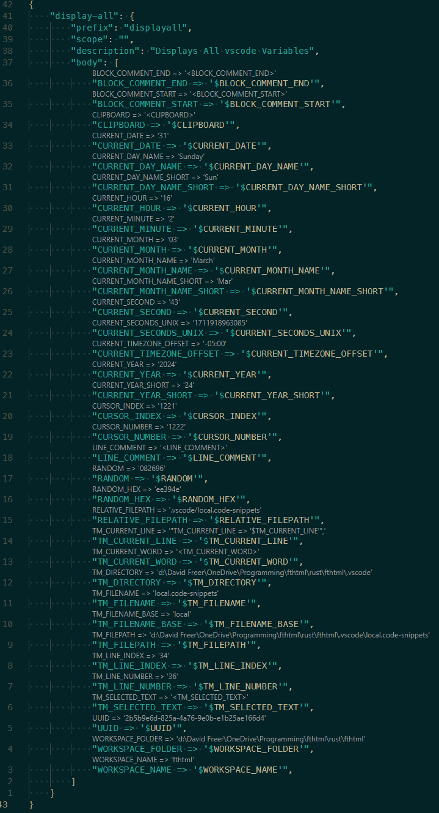
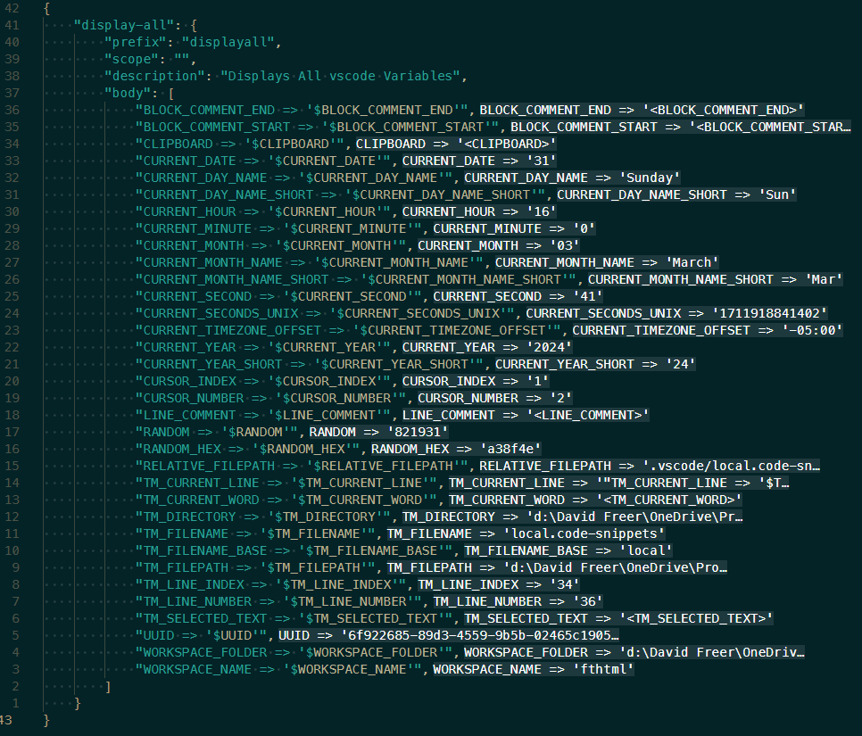
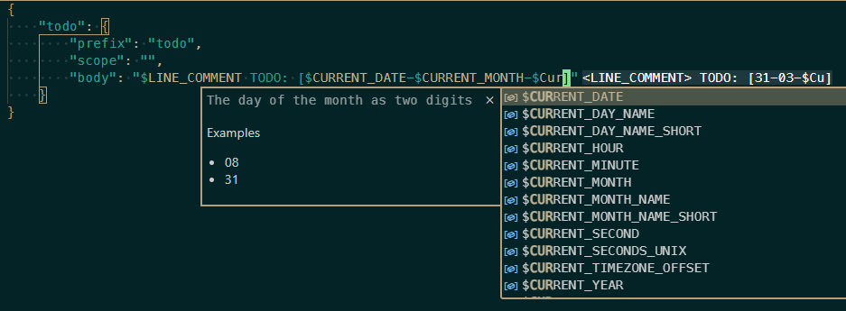

# vscode-snippet-lang extension

Install: https://marketplace.visualstudio.com/items?itemName=davidfreer.vscode-snippet-lang

> What is this extension?

It's an extension to support the default `snippets` language in vscode by providing code completion for all the [snippet variables](https://code.visualstudio.com/docs/editor/userdefinedsnippets#_variables) you never remember

The `snippet` language was recently introduced which makes it easier to write extensions for now that it has a dedicated language id. So here we are, you and I

> Why does this extension exist?

🤷‍♂️ I wish it didn't have to

> Why isn't this built into a 10 year old text editor?

🤷‍♂️

> What does this extension offer?

It's not the best extension ever but it also didn't come out bad for a weekend project

- Codelens (if you wanna)
- Inlay hints (if you wanna)
- Inline Suggestions/'Code' Completion
- Hover documentation
- Supports browser vscode sessions
- A couple snippets
    - snippet for creating snippets (yup, that's right)
    - snippet for [choices](https://code.visualstudio.com/docs/editor/userdefinedsnippets#_choice)

## Codelens

Shows you a 'preview' of what the snippet string would be (line by line)

> :note: This is meant to emulate for a quick visual not be a direct representation, though I tried to resolve values as much that made sense

Opt out with `vscode-snippet-lang.codelens.enabled` setting




## Inlay Hints

Shows you a 'preview' of what the snippet string would be (line by line)

> :note: This is meant to emulate for a quick visual not be a direct representation, though I tried to resolve values as much that made sense

Opt out with `vscode-snippet-lang.inlayhints.enabled` setting



## Code Completion

Because we all forget what these variables are from time to time

Completes as you type (inline) as well as triggered



## Snippets

1. A snippet for creating snippets

```
{
    "snippet": {
        "scope": "snippets",
        "prefix": "snippet",
        "description": "Create a snippet",
        "body": [
            "\"${1:name}\" : {",
            "\t\"prefix\" : \"$2\",",
            "\t\"scope\" : \"$3\",",
            "\t\"description\" : \"$4\",",
            "\t\"body\" : [",
            "\t\t$0",
            "\t]",
            "}"
        ]
    }
}
```

2. A choice snippet (inline suggestion)

```
label: 'choice',
kind: CompletionItemKind.Snippet,
insertText: new SnippetString('${${1:1}|${2:a},${3:b}|}')
```
